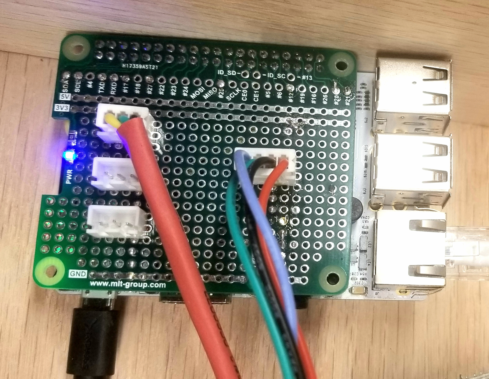
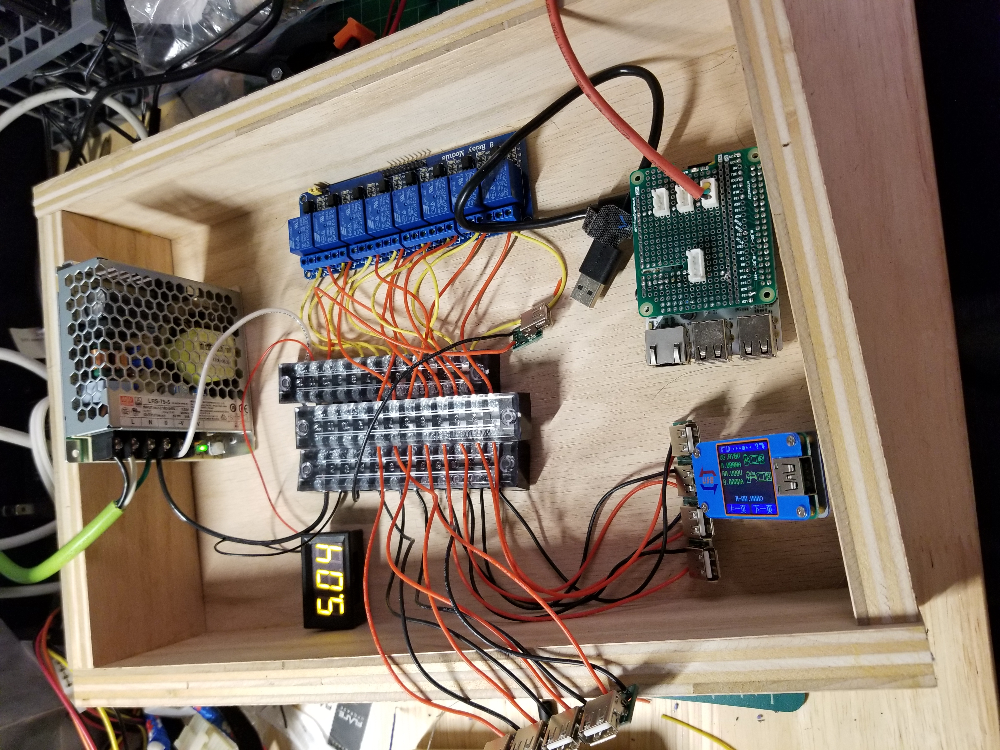

# sbc-gpio-pcf857x
GPIO scripts and examples for linux / Armbian, RPI alternatives using i2c [pcf8574](https://www.ti.com/product/PCF8574) IO Expander found in cheap GPIO breakout boards.

## background
My personal use case was to make a uart and gpio control hat for a [Libre Computer Tritium H5](https://www.loverpi.com/collections/tritium) to control power for SBCs and collect consoles.

Because I wired relays to be normally closed.  Relay Off == power on, Relay On == power off.   My [shell library](lib/gpio.sh) functions reflect that use case.




## Getting Started

### prerequisites
* Be sure to enable your i2c bus in `armbian-config` and reboot
* install `i2c-utils` package
* Figure out your address of the io expander.. default is 0x38.  See resources below on how to confirm with i2cdetect, etc

### initialize

My gpio breakout board showed up as `gpio504` this means the gpio pin names are gpio504-gpio511

I added folllowing lines into my `/etc/rc.local` script to load kernel module and load driver for i2c and expander

```sh
modprobe gpio-pcf857x
echo pcf8574 0x38 > sys/bus/i2c/devices/i2c-0/new_device
```

### example - bash

requires running as root....

```sh
source lib/gpio.sh
demo
```

```sh
source lib/gpio.sh

gpio_init
gpio_show_all
gpio_set 505 value 1
gpio_show_all
sleep 1s
gpio_bounce 506
gpio_bounce 507
gpio_show_all
gpio_unexport_all
```

### example - python

Running on [Orange Pi PC](https://www.armbian.com/orange-pi-pc/); with 2 LEDs on gpio 12 and 13

```sh
sudo python3 lib/api.py -c /dev/gpiochip0 -l 12 13
```

Then, on the same device

```sh
curl localhost:5000/on
curl localhost:5000/off
```

Or form an other device on the same network

```sh
curl orangepipc.local:5000/12/toggle
curl orangepipc.local:5000/13/bounce
curl orangepipc.local:5000/toggle
curl -s orangepipc.local:5000/state | jq
```

```json
{
  "12": {
    "active": "high",
    "direction": "output",
    "value": 0
  },
  "13": {
    "active": "high",
    "direction": "output",
    "value": 1
  }
}
```

```sh
curl orangepipc.local:5000/13/toggle
curl -s orangepipc.local:5000/13/state | jq
```

```json
{
  "active": "high",
  "direction": "output",
  "value": 0
}
```

routes */gpio-num/#* impacts a single gpio while */#* impacts all configured lines

## resources
* https://www.ti.com/product/PCF8574
* https://elixir.bootlin.com/linux/v2.6.30/source/Documentation/i2c/chips/pcf8574
* https://github.com/torvalds/linux/blob/master/Documentation/i2c/old-module-parameters.rst
* https://www.waveshare.com/wiki/Raspberry_Pi_Tutorial_Series:_I2C
* [clicky demo video](https://www.youtube.com/watch?v=CRsYRhhzGEs)
